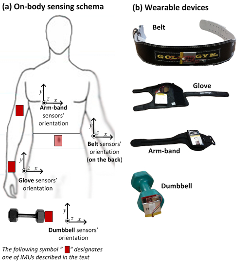

## Executive Summary

With fitness trackers becoming more and more ubiquitous, people are increasingly quantifying how much exercise they are doing. However, an important parameter missing from these discussions is how *well* they are doing it. This research aims to add to this dimension by using data from the fitness trackers to classify how well the exercise is being done. A random forest model was created on the model with an out of sample accuracy of 99.68%.   

## Data Overview

   

    


The data consists of 160 variables of measurements taken by the sensors on the arm, wrist, belt and the dumbbell. The exercise was then classified in 5 groups: Class A to Class E, with Class A denoting the exercise was done well, as per the instructions, and the other classes denoting common mistakes made while exercising. More information about the data can be found [here](http://groupware.les.inf.puc-rio.br/har).   

## Loading and Pre-Processing Data

```{r settings, echo = FALSE, message = FALSE,warning = FALSE}
require(knitr)
knitr::opts_chunk$set(message = FALSE,warning = FALSE,cache = FALSE)
require(pander)
require(tidyr)
panderOptions('digits','3')
```

First we need to load and process our data.  

```{r load,cache = TRUE}
original <- read.csv("pml-training.csv")
require(pander)
pander(dim(original))
```

There are 160 variables. Exploring the dataset reveals that many variables have mostly NA values in them. Moreover, the first five variables are just user identification and timestamp, so not of much use in building our model. Moreover, many variables were numeric, but were coerced to factors when loading, that also needs to be corrected. Many factor variables also had no values just " ","","." or "#DIV/0!", and they will all be removed as well.   

```{r preProcess,cache = TRUE}
k <- apply(original,2,function(x) sum(is.na(x))) # find number of NA's for all columns
df <- original[which(k==0)]  # remove columns which were mostly NAs (19216/19622 NAs)
df <- df[-(1:5)]   # remove name and timestamp
div0 <- c(9,12,15,49,52,55,71,74,77) # variables that had #DIV/0! values mostly
df <- df[-div0] # remove them

require(tidyr) # for extract_numeric function
for(i in 2:78){
     df[,i] <- extract_numeric(df[,i]) # convert factors to numeric
}

k2 <- apply(df,2,function(x) sum(is.na(x))) # some numeric again mostly na
df <- df[which(k2==0)] # so removing columns with mostly na
pander(dim(df))
```

That's a hundred and five variables removed now. The remaining 55 variables will now be used to train our algorithm.  

Now let us partition our data into a training set and validation set (we already have a test set), using a 60:40 split.   

```{r partition,cache = TRUE}
set.seed(1234)
require(caret)
inTrain <- createDataPartition(df$classe,p = 0.6, list = FALSE)
training <- df[inTrain,]
validation <- df[-inTrain,]
```


## Model Selection

To select the model, various models were created using random forests, random forests with boosting, logistic regression, linear discriminant analysis, and support vector machines. I will only display the accuracy measures of the different models here (building them all again for the report will take too much time), and the full details of the final model selected after that.    

```{r modelSummaries,echo = FALSE}
Accuracy <- c(.9954117,0.9975784,0.7137395,0.9881468,0.4655876,0.9956666)
Algorithm <- c("Random Forest","Random Forest (with resampling)","Linear Discriminant Analysis","gbm (boosted trees)","Ridge","Support Vector Machine")
models <- data.frame(Algorithm = Algorithm,Accuracy = paste0(round(Accuracy*100,2),"%"))
pander(models,justify = "lr")
```
   
   
Looking at these results, random forests and support vector machines provide the best results. Further tweaking of these two models lead to a random forest based model providing the best results.   

```{r creatingModel,cache = TRUE}
require(randomForest)
library(doParallel) # for faster parallel processing (Windows)
cl <- makeCluster(detectCores())
registerDoParallel(cl)
# training Model
finalFit <- train(training[,-55],training$classe,
                  method = "parRF",
                  trControl = trainControl("cv",5),
                  tuneGrid = data.frame(mtry = c(7,14,28)))
stopCluster(cl) # parallel processing over
# predicting on validation set
pred.Final <- predict(finalFit,validation)

# creating a confusion matrix for our results
cf <- confusionMatrix(pred.Final,validation$classe)
```
  
  
The model was built using the "parRF" method which stands for parallel random forest. 5-folds cross-validation was used, and the given 3 values of mtry were to be used.   

Now let us view the model.   

```{r ModelSummaries}
finalFit
cf
```

The final model has a training set accuracy of 99.51%, and an out of sample (test set) accuracy of 99.68%, which is quite good. The other details about the model, and the metrics are all presented above.  

Now let us finally get to predicting on our test dataset.

## Test Data

First of all, we need to reduce our test dataset to the same variables that our training data set contained.  

```{r loadTest}
origin2 <- read.csv("pml-testing.csv")
testing <- origin2[,names(df)[-55]] # last column df is classe, not in test data
# converting to numeric according to training set
for(i in 2:54){
     testing[,i] <- extract_numeric(testing[,i]) # convert factors to numeric
}
# converting first column to 2 levels as it should be
levels(testing[,1]) <- c("no","yes")
```
  
Now that the test dataset is similar in features to our training data set, let us predict using our model.   
```{r prediction}
prediction <- predict(finalFit,testing)
pander(data.frame(ID = 1:20,Class = prediction))
```

Using these predictions on the quiz resulted in 20/20.  

